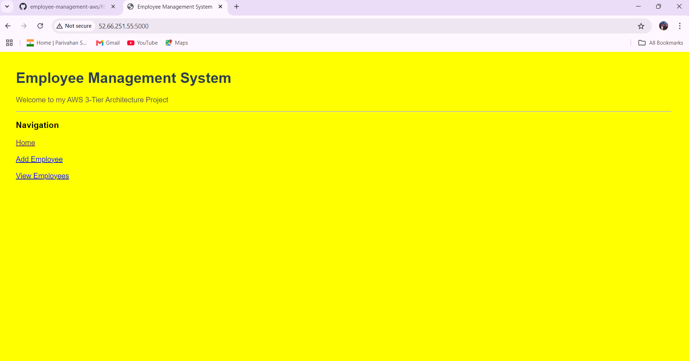
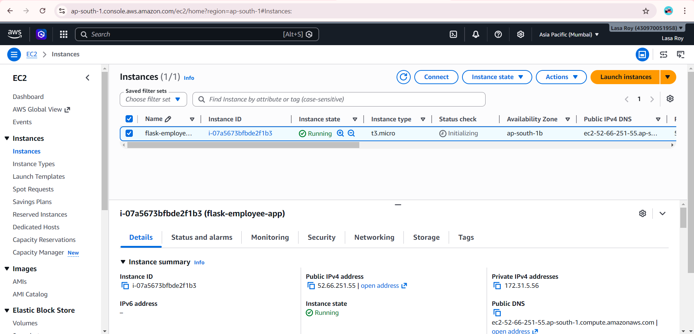
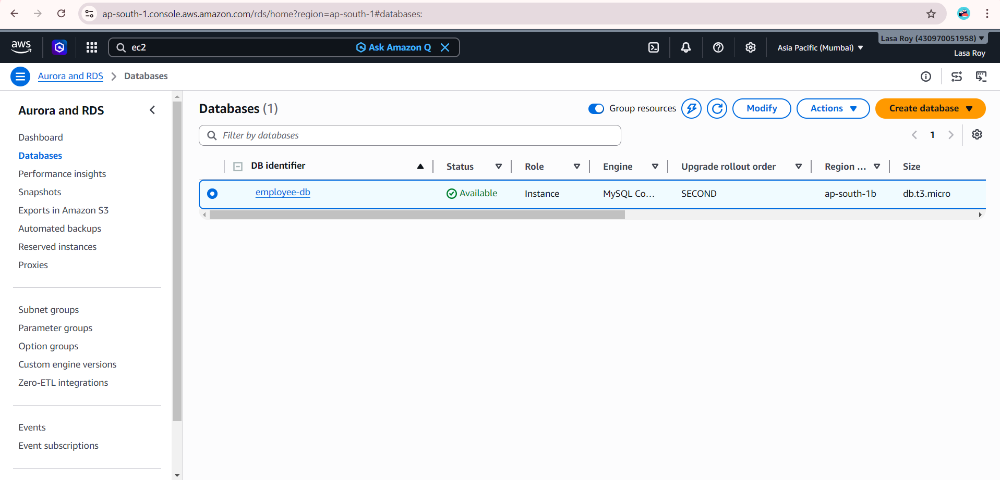

# Employee Management System on AWS

## Project Overview

This project is a Flask-based Employee Management System deployed on AWS using a 3-tier architecture. The application is hosted on Amazon EC2, and employee data is stored in Amazon RDS MySQL.

## Architecture Diagram

```text
+------------------+
|  User Browser    |
+------------------+
          |
          v
+------------------+
| AWS EC2 (Flask)  |
+------------------+
          |
          v
+------------------+
| AWS RDS MySQL    |
+------------------+
```


## Technologies Used

* Python
* Flask
* MySQL
* AWS EC2
* AWS RDS
* Git & GitHub

## Features

* Add Employee
* View Employee
* Store employee data in MySQL database

## AWS Services Used

* Amazon EC2
* Amazon RDS
* Security Groups

## Project Workflow

1. User accesses the application from a browser.
2. The Flask application runs on EC2.
3. The application connects to RDS MySQL.
4. Employee data is stored and retrieved from the database.

## Screenshots

### Application UI


### EC2 Instance


### RDS Database


## Future Enhancements

* Docker containerization
* CI/CD using Jenkins
* Infrastructure automation using Terraform
* Kubernetes deployment
